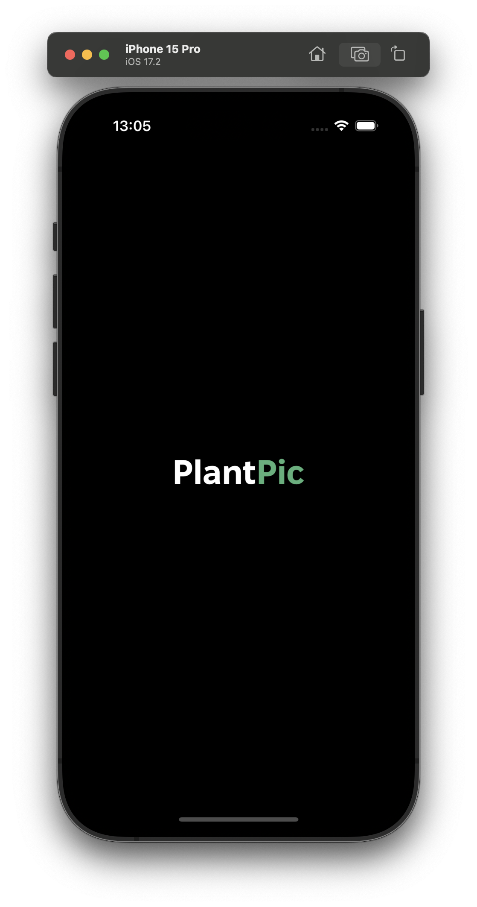
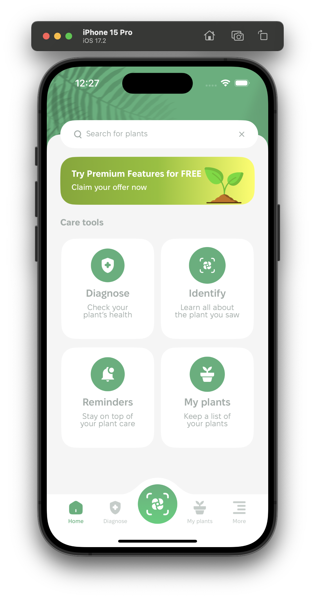
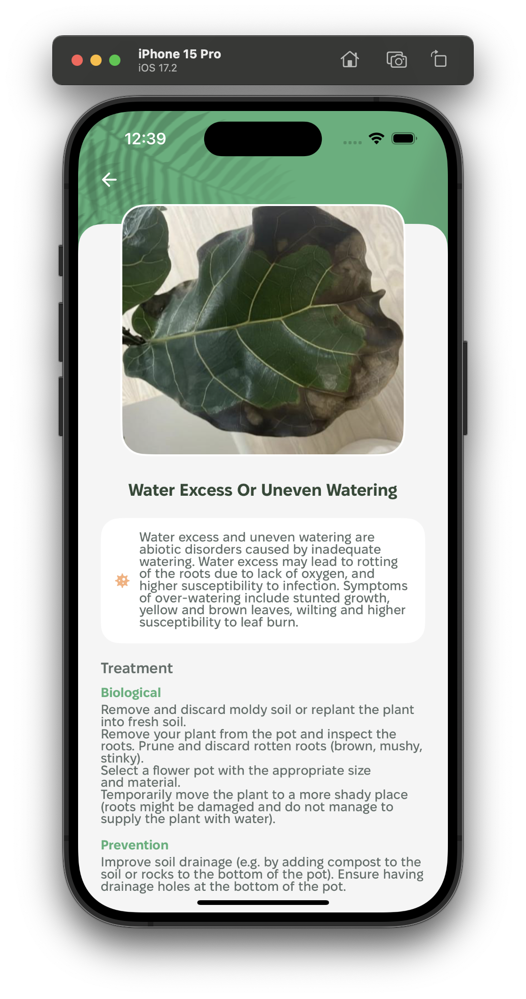
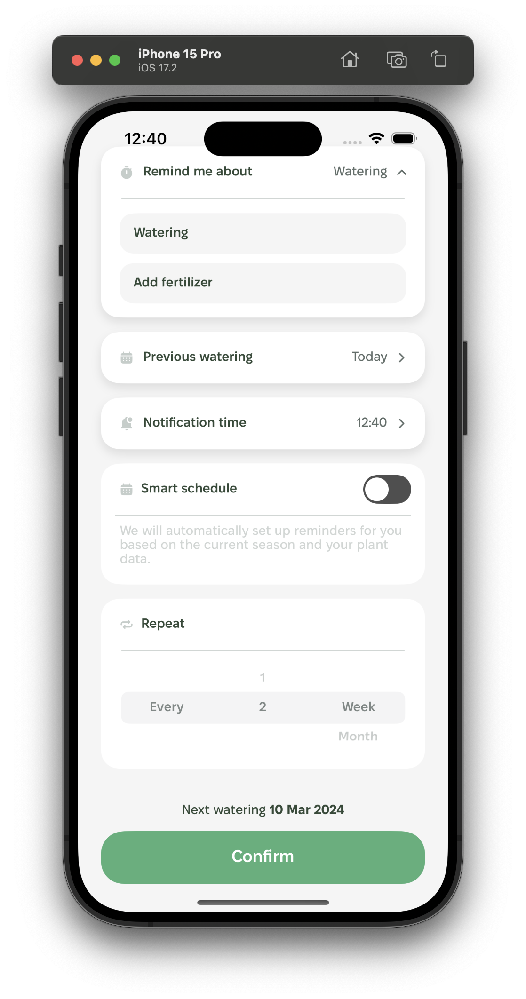
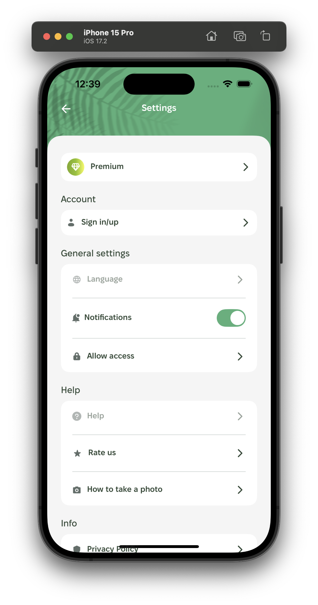
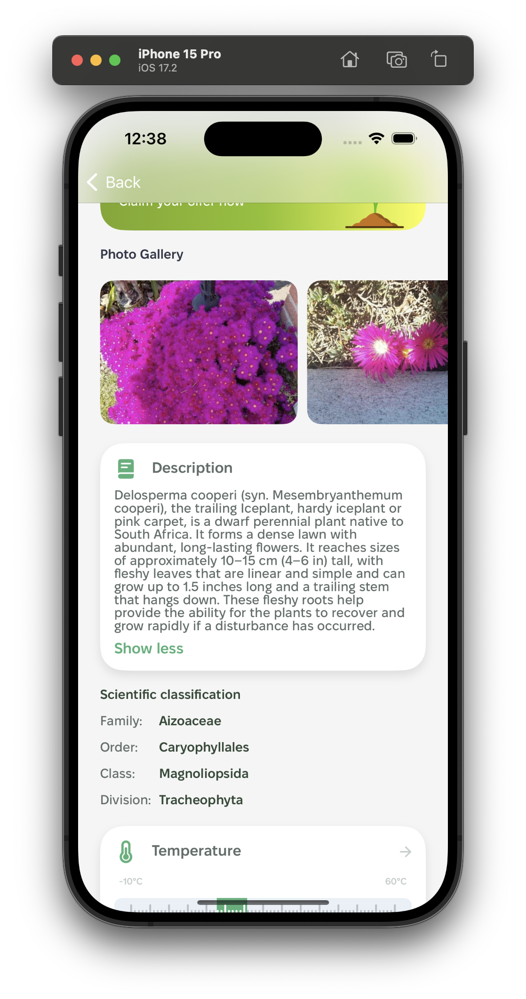

# PlantPic

**Version:** 1.0.0

 1. [x] **Palywall**
 2. [x] **Onboarding** 
 3. [x] **Home** 
 4. [x] **Diagnose** 
 5. [x] **Identification Result** 
 6. [x] **My Plants** 
 7. [x] **My Garden** 
 8. [x] **Plant Details** 
 9. [x] **More (Settings)** 
10. [x] **Diagnose Result**
15. [x] **AppIcon**

## Screenshots

 
   
 

  

 
 
 

  

 
 
 

  

## Frameworks and dependencies

[SwiftUI](https://developer.apple.com/xcode/swiftui/) - UI toolkit.

[Combine](https://developer.apple.com/documentation/combine/) - Swift API for processing values over time.

[SwiftData](https://developer.apple.com/xcode/swiftdata/) - Framework for data modelling and management.

[Kingfisher](https://github.com/onevcat/Kingfisher) - Swift library for image downloading and caching.
 
